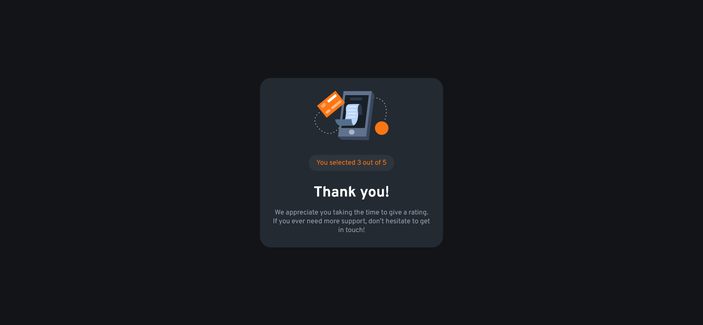

#Interactive rating component solution

This is a solution to the [Interactive rating component challenge on Frontend Mentor](https://www.frontendmentor.io/challenges/interactive-rating-component-koxpeBUmI).

## Table of contents

- [Overview](#overview)
  - [The challenge](#the-challenge)
  - [Screenshot](#screenshot)
  - [Links](#links)
- [My process](#my-process)
  - [Built with](#built-with)
  - [What I learned](#what-i-learned)
  - [Useful resources](#useful-resources)
- [Author](#author)

## Overview

### The challenge

Users should be able to:

- View the optimal layout for the app depending on their device's screen size
- See hover states for all interactive elements on the page
- Select and submit a number rating
- See the "Thank you" card state after submitting a rating

### Screenshot

Desktop rating

Desktop thank

[Mobile version](screenshots/mobile-rating.png)

### Links

- Solution URL: [Interactive rating GitHub](https://github.com/EugeneZanevskij/Interactive-rating)
- Live Site URL: [Interactive rating Live version](https://eugenezanevskij.github.io/Interactive-rating/)

## My process

### Built with

- Semantic HTML5 markup
- CSS custom properties
- Flexbox
- CSS Grid
- Mobile-first workflow

### What I learned

I got familiar with `:focus` selector.
It represents an element (such as a form input) that has received focus. It is generally triggered when the user clicks or taps on an element.

### Useful resources

- [:focus selector](https://developer.mozilla.org/en-US/docs/Web/CSS/:focus) - This is a documentation on `:focus` selector.

## Author

- LinkedIn - [Eugene Zanevskij](https://www.linkedin.com/in/eugene-zanevskij/)
- Frontend Mentor - [@EugeneZanevskij](https://www.frontendmentor.io/profile/EugeneZanevskij)
- GitHub - [@EugeneZanevskij](https://github.com/EugeneZanevskij)